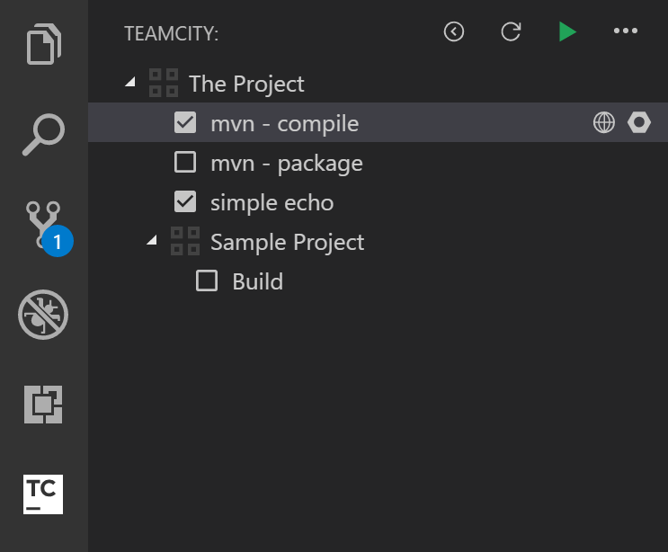

# TeamCity Extension for Visual Studio Code [](https://confluence.jetbrains.com/display/ALL/JetBrains+on+GitHub)

This extension allows you to connect to a TeamCity Server and run personal builds on the TeamCity server without leaving Visual Studio Code.

## Prerequisites
### Git Version Control
If you are planning on using the extension with Git, ensure your Git version is equal or greater than 2.0.0. The extension uses the Git command line to collect staged resources and process git commit/push operations. 

### Team Foundation Version Control
Once you have a local TFVC workspace available, you must configure the TFVC support in Visual Studio Code. Details (including demo videos) are available in the [TFVC documentation](https://github.com/microsoft/vsts-vscode/blob/master/TFVC_README.md).

## Installation
First, you will need to install [Visual Studio Code](https://code.visualstudio.com/download) `1.23.0` or later.

To install the extension with the latest version of Visual Studio Code (version `1.24.1` is the latest as of this writing), download the last pre-release version of the TeamCity extension from the [corresponding page](https://github.com/JetBrains/teamcity-vscode-extension/releases), bring up the Visual Studio Code Command Palette (`F1`), type `Install from VSIX` and choose the `teamcity-vscode-extension-***.vsix` file in the opened dialoge box. Restart Visual Studio Code.

Alternatively, you can also install using the VS Code ```--install-extension``` command line switch providing the path to the .vsix: 
```
code --install-extension myextension.vsix
```
## Authentication
When you are connecting to the TeamCity Server, you will only need your TeamCity server credentials (domain name, account name and password).

To sign in to your account, run the `teamcity signin` command. You will be prompted to enter your credentials. When you do, and the authorization on the TeamCity server is successful, your will be prompted to save credentials securely on your local machine.

## Credentials Storage
On Windows, your credentials wil be stored by Windows Credential Manager. On macOS, your credentials will be stored in the Keychain. On Linux, your credentials will be stored in a file on your local file system in a subdirectory of your home folder. That file is created only with RW rights for the user running Visual Studio Code.

## Commands
The extension provides several commands for interacting with the TeamCity API. 
In the Command Palette (`F1`), type `TeamCity` and choose a command.

* `TeamCity: Sign in` – This command is used for signing in to a TeamCity server. When required credentials are provided, they are sent to TeamCity server
to validate them and get internal user information. If validation is passed, it will be stored securely if possible on user
the computer and used to connect to the TeamCity server.

* `TeamCity: Sign out` – This command is used for signing out of a TeamCity server.

## TeamCity View Container
The extension uses custom tree data providers under the TeamCity view container to provide most of features.



## Detailed Remote Run Results
The extension writes personal build statuses into the TeamCity output. This is a simple and convenient way to navigate to the Build Overview page.


## Logging
You may need to enable file logging to troubleshoot an issue. There are four levels of logging (`error`,
`warn`, `info`, and `debug`). Since logging is disabled by default, you can add an entry like the one below
to the Visual Studio Code settings and restart VSCode. Once you are finished logging, either remove the setting or set it to an empty string and restart VSCode.
```javascript
"teamcity.logging.level": "debug"
```
The log file will be placed at the root of your workspace and will be named `teamcity-extension.log`.

## Debugging
To start debugging the extension, do the following:
1. Clone the repository from the GitHub [repository](https://github.com/JetBrains/teamcity-vscode-extension/issues).
2. Execute the `npm install` command from the root of the project.
3. Open the project via the `Visual Studio Code` editor
4. `Debug` -> `Start Debugging` 

## Packaging
To package a custom version of the extension, please refer to the [VSCode documentation](https://code.visualstudio.com/docs/extensions/publish-extension#_packaging-extensions).

## Support
Support for this extension is provided in [GitHub Issue Tracker](https://github.com/JetBrains/teamcity-vscode-extension/issues). You
can submit a [bug report](https://github.com/JetBrains/teamcity-vscode-extension/issues/new), a [feature request](https://github.com/JetBrains/teamcity-vscode-extension/issues/new)
or participate in [discussions](https://github.com/JetBrains/teamcity-vscode-extension/issues).

## License
This extension is [licensed under the MIT License](LICENSE.txt).

